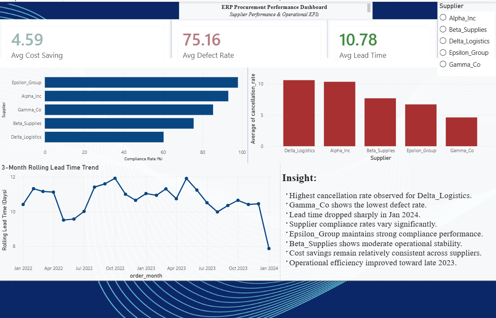

# ERP Procurement KPI Dashboard

## Overview

This project analyzes supplier procurement performance using Power BI dashboards and ERP procurement data.

The dashboard focuses on:

- Supplier compliance performance
- Defect rate analysis
- Procurement lead time trends
- Cost-saving evaluation
- Supplier cancellation analysis

---

## Tools & Technologies

- Power BI
- SQL
- Python
- Pandas
- Jupyter Notebook

---

## Dashboard Features

- KPI cards for operational metrics
- Supplier comparison charts
- Rolling lead time trend analysis
- Interactive slicers
- Custom tooltips
- Drillthrough supplier details page

---

## Key Insights

- Delta_Logistics shows the highest cancellation rate.
- Gamma_Co maintains the lowest defect rate.
- Lead times improved toward late 2023.
- Supplier compliance varies significantly across vendors.

---

## Dashboard Preview



---

## Project Structure

```text
data/
dashboard/
database/
notebooks/
screenshots/
```

---

## Data Source

Dataset sourced from Kaggle:

https://www.kaggle.com/datasets/shahriarkabir/procurement-kpi-analysis-dataset

---

## Files Included

- Power BI dashboard (.pbix)
- Procurement KPI dataset (.csv)
- SQLite database (.db)
- Jupyter analysis notebook
- Dashboard screenshots

---

## Future Improvements

- Advanced DAX measures
- Supplier risk scoring model
- Forecasting and predictive analytics
- Automated Power BI refresh pipeline

---

## Author

Mehdi Zamani

GitHub:
https://github.com/mehdi-zamani1990
